# Webaverse

# User Documentation

## What is Webaverse?

Webaverse is an MMO which is brought alive by NFTs.
We are working towards making the best rendition of the metaverse. We want to create the metaverse so that it is open, fun and interoperable. We have a strong belief that the metaverse should not be owned or influenced by the big, nasty corporations…...so we decided to make it ourselves.This document will help you get started and experience this platform first hand.

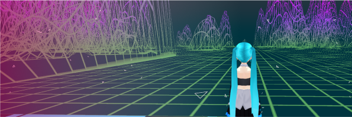

## Getting Started

### Getting started is as easy as 1-2-3!

1. Open your browser
2. Go to https://app.webaverse.com
    
    
    
3. Have fun!

# **User Interface**

1. Character Menu- Includes a list of all the active interactables.
2. Hotkeys- 
3. Environment Menu- Shows a list of all the available environments.
4. Room- Make your own room
5. Mic Toggle- Turn your mic on or off for voice chat. Hotkey: T
6. Log In- Connect your wallet to the app
7. Token Menu- Menu showing list of all objects in the world

**Character Menu:**

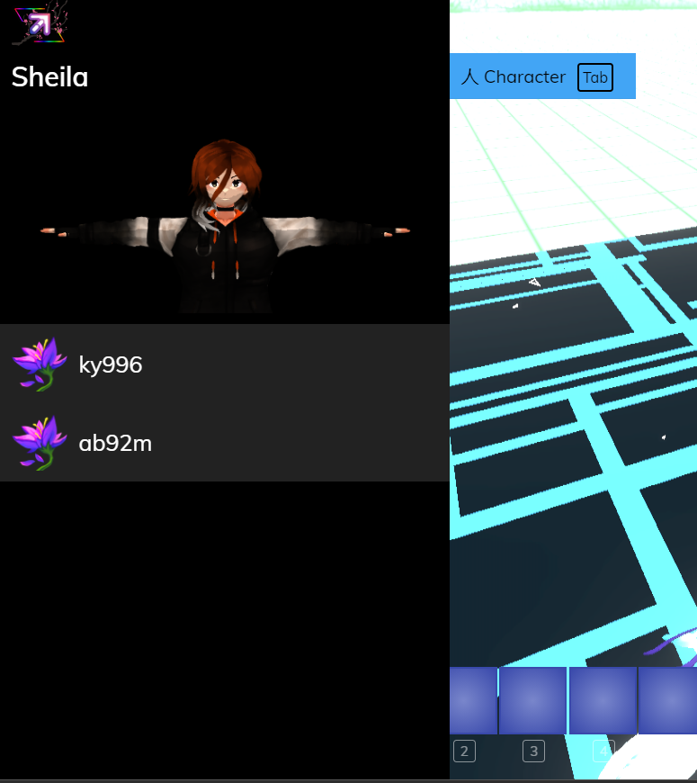

See a list of active interactables and remove them through the character menu.

**Token Menu:**

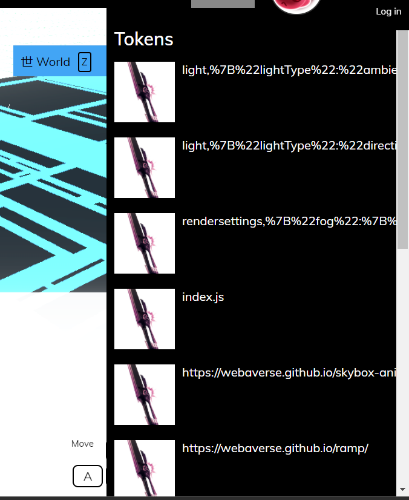

**Environment Menu:**

List of all available environments to change to.

# Movement:

To move around in the webaverse you will need a basic mouse and a keyboard setup.

## Keyboard:

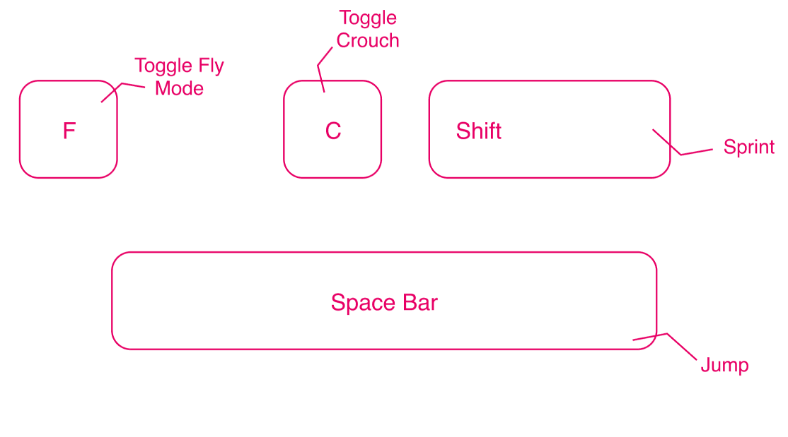

## Mouse:

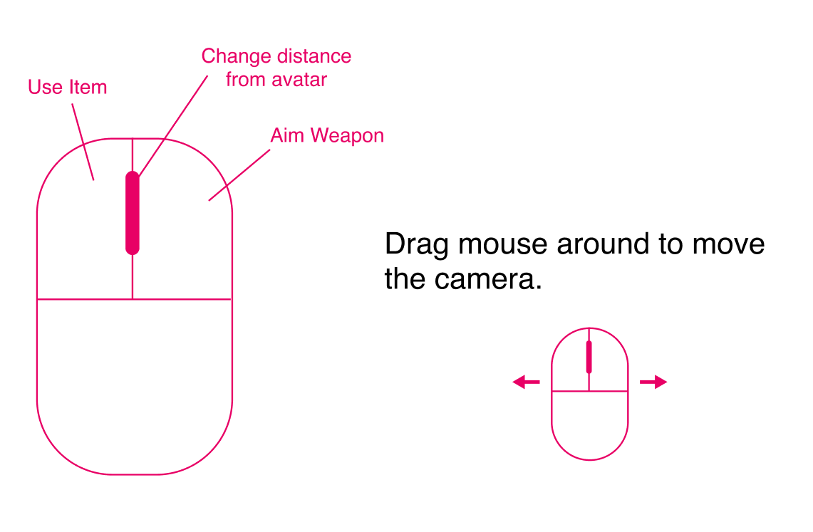

[scrnli_11_1_2021_12-59-44 AM.webm](UserDocs-Assets/scrnli_11_1_2021_12-59-44_AM.webm)

# Dash:

You can move at extremely fast speeds, by using Dash.

To start dashing, double tap the 'Shift' key on your keyboard and hold down the shift key after the second tap as long as you want to continue moving.

[scrnli_11_3_2021_5-00-21 PM.webm](UserDocs-Assets/scrnli_11_3_2021_5-00-21_PM.webm)

# Interactables:

There are alot of interactables on the platform for you to try. If an object is an interactable then you will see an ‘E’ appear on it when you move close to the object.

To interact with the object, press and hold ‘E’ key on your keyboard until the blue bar is filled.

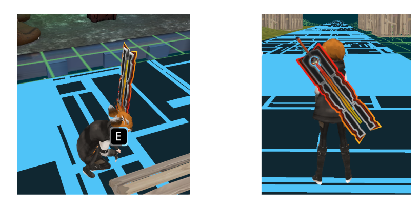

Once the interactable is active you can use it using the movement keys mentioned above.

**To stop using an interactable:**

- Press the ‘Tab’ key on your keyboard.
- Access the character menu.
- Click on the cross next to the name of the you want to remove.

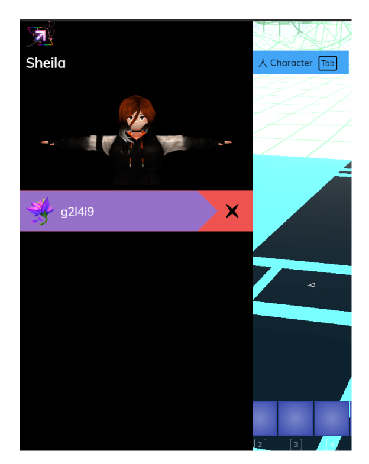

## Types of interactables:

- Melee Weapons
- Ranged Weapons
- Pets
- Vehicles

Melee Weapons

Weapon interactables can be equipped and used to damage other objects

in the game.

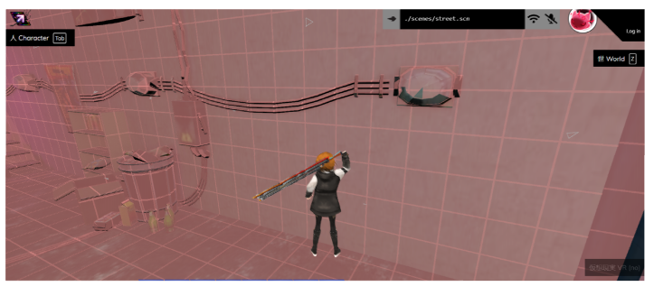

                                                      Using a sword to damage a wall

To use the melee weapon, press the left mouse button.

[scrnli_10_31_2021_11-32-02 PM.webm](UserDocs-Assets/scrnli_10_31_2021_11-32-02_PM.webm)

Ranged Weapons

Ranged Weapon interactables can be used to damage objects that are present at a

distance from you.

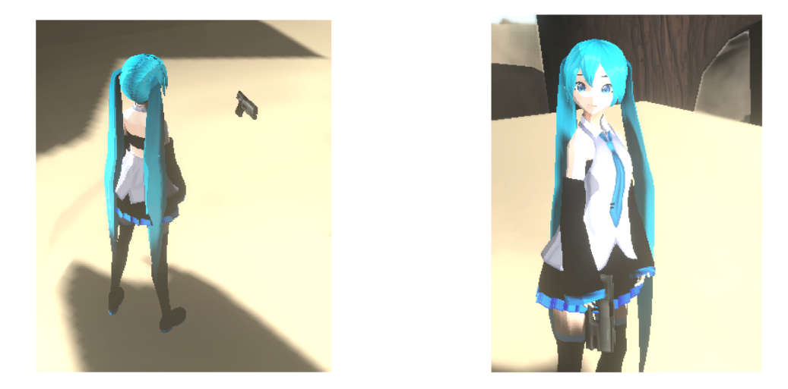

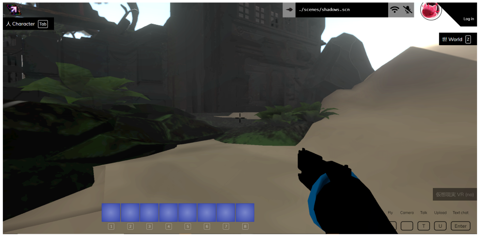

Press the right mouse key to aim the gun, and press the left mouse button to shoot.

[scrnli_10_31_2021_11-23-18 PM.webm](UserDocs-Assets/scrnli_10_31_2021_11-23-18_PM.webm)

Pets

Pets are your companions in the webaverse. Go near a pet, press and hold

the ‘E’ key and then your pet will follow you.

You can make a pet stop following you the same way you remove an interactable from your character.

[scrnli_10_31_2021_10-25-23 PM.webm](UserDocs-Assets/scrnli_10_31_2021_10-25-23_PM.webm)

Vehicles

Vehicles are driveable objects. Interact with them by pressing and holding

the ‘E’ key. Once your avatar is seated, use the movement controls to drive

the vehicle.

Press ‘Space Bar’ on your keyboard to get off the vehicle.

[scrnli_10_31_2021_10-14-05 PM.webm](UserDocs-Assets/scrnli_10_31_2021_10-14-05_PM.webm)

# Fly Mode:

Fly mode enables you to travel in any direction, disregarding gravity, as well as allows you to travel through objects.

Press 'F' on the keyboard to enable fly mode. 

Fly mode will be enabled when you see that your avatar has changed from a standing state to a ragdoll state.

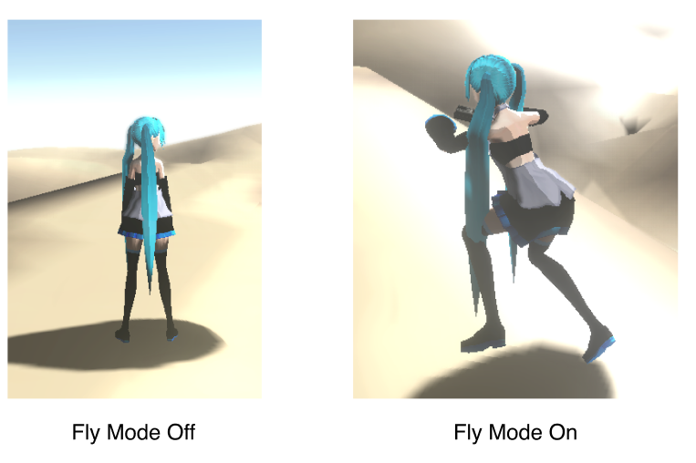

After enabling fly mode, use the movement keys to control where your avatar goes.

[scrnli_10_31_2021_10-08-07 PM.mp4](UserDocs-Assets/scrnli_10_31_2021_10-08-07_PM.mp4)

# Placing .glb models:

You can place custom .glb 3D models into the world by a simple drag-and-drop method.

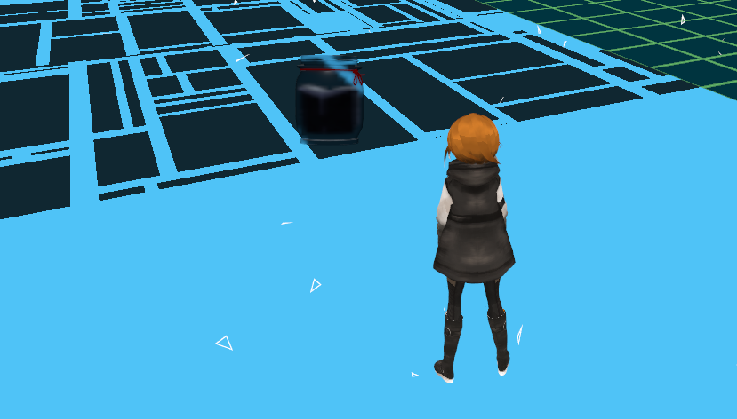

# Changing Avatars:

Changing avatars is the same as using interactables. Walk towards an avatar in the world until the 'E' appears on the avatar. Then press and hold the 'E' key on your keyboard to change into that avatar.

[scrnli_11_2_2021_3-11-12 AM.webm](UserDocs-Assets/scrnli_11_2_2021_3-11-12_AM.webm)

## Changing into custom avatars:

You can use custom .vrm avatars. To do so, drag and drop a .vrm file format avatar into the world. Then, walk towards it and press and hold the 'E' key to change into that avatar.

[scrnli_11_2_2021_3-43-45 AM.webm](UserDocs-Assets/scrnli_11_2_2021_3-43-45_AM.webm)

# Changing Environments:

Click on the arrow present highlighted in the below screenshot.

A list of available environments will open up. Click on the one you want to change to.

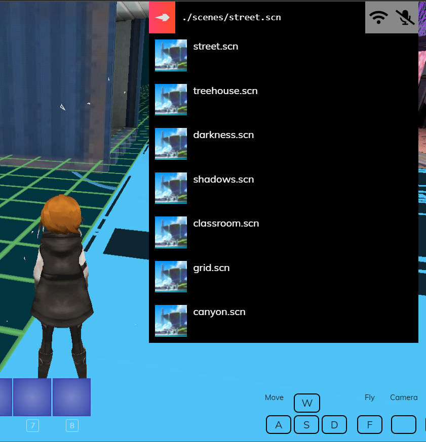

[scrnli_10_31_2021_11-42-26 PM.webm](UserDocs-Assets/scrnli_10_31_2021_11-42-26_PM.webm)

# World Menu:

The 'Z' key, activates the World panel on the right side of the screen. Here we can see all of the objects in our scene. For instance we can see our Hovercraft vehicle in this picture.

In this menu we can modify position, rotation and scale of the object.

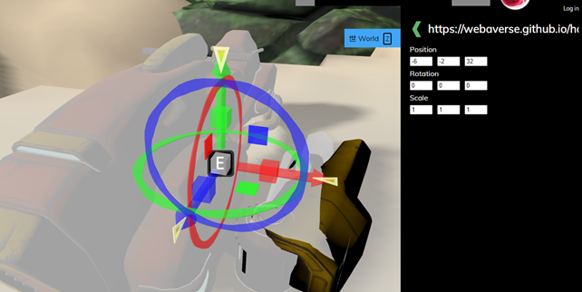

[scrnli_11_2_2021_2-23-50 AM.webm](UserDocs-Assets/scrnli_11_2_2021_2-23-50_AM.webm)

# Chatting:

You can chat textually by pressing the 'Enter' key on your keyboard.

Press 'Enter' on your keyboard to open the text box.

Enter a phrase and press 'Enter' again to submit.

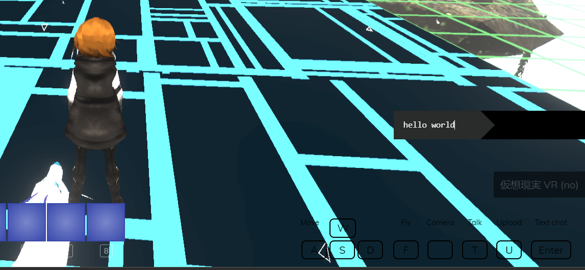

[scrnli_11_1_2021_12-53-37 AM.webm](UserDocs-Assets/scrnli_11_1_2021_12-53-37_AM.webm)

## Gestures:

Your avatar has the ability to perform gestures, which it recognizes from the emoticons you type into the chat text field.

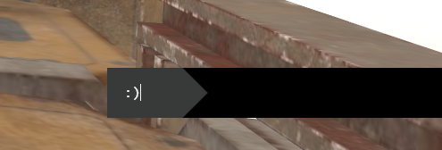

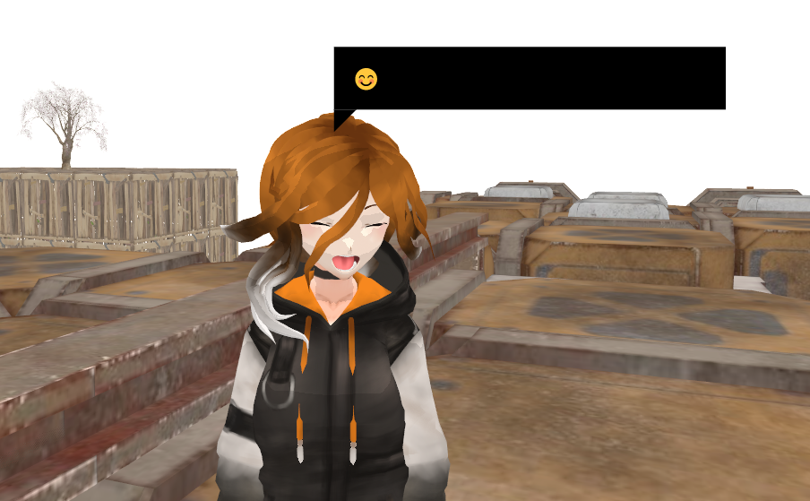

[scrnli_11_1_2021_9-25-03 PM.webm](UserDocs-Assets/scrnli_11_1_2021_9-25-03_PM.webm)

# Dance:

You can make your avatar dance by holding the 'V' key on your keyboard.

[scrnli_11_2_2021_2-18-14 AM.webm](UserDocs-Assets/scrnli_11_2_2021_2-18-14_AM.webm)

# Special Mode:

Press the '~' key on your keyboard to activate the Special Mode. This mode allows you to manipulate the objects on the platform.

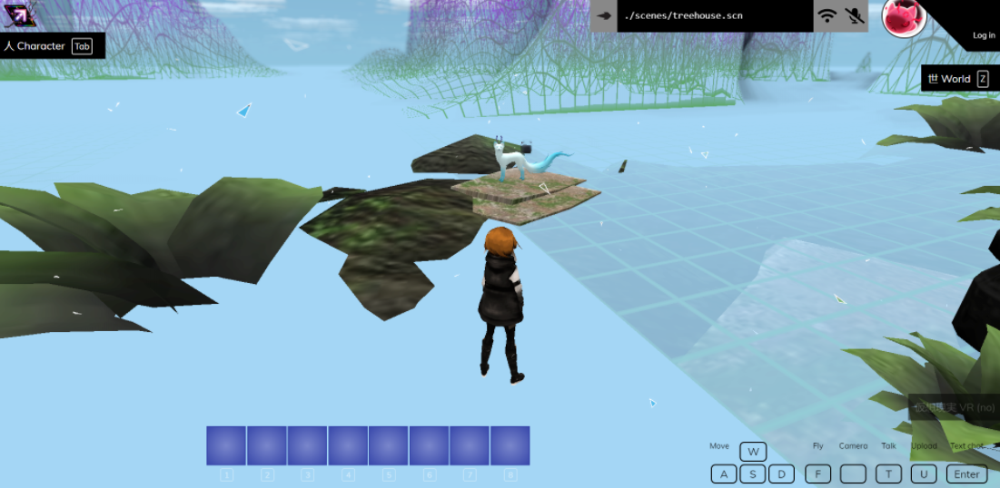

You will notice that the Special Mode is activated when the object you are looking at becomes highlighted.

To select an object to manipulate, make sure that it is highlighted and then press the left mouse button.

After selecting the object, you will immediately be able to move the object, changing its position based on where you point your mouse.

While the object is selected:

Use the 'E' and 'R' keys to rotate the object in its position.

Press the 'X' key to delete the object.

Press the 'F' key to move the object further away from you.

Press the 'C' key to bring the object closer to you.

Press the 'V' key to turn on Grid Snapping.

Press the left mouse button to place the object.

[scrnli_11_3_2021_5-27-05 AM.webm](UserDocs-Assets/scrnli_11_3_2021_5-27-05_AM.webm)

# **Discord Bot**

The Discord Bot allows anyone to manage their profile, items inventory, avatar, and create just by typing in Discord.

You can interact the Webaverse Discord Bot by inviting it to your Discord server [here](http://web.archive.org/web/20210302052630/https://discord.com/oauth2/authorize?client_id=758956702669209611&permissions=0&scope=bot). Or you can interact with the bot by joining the [Webaverse Discord](http://web.archive.org/web/20210302052630/https://discord.gg/3byWubumSa) server.

The Discord Bot runs on an Ethereum side chain and allows you to interact with the blockchain by running commands in Discord like `.inventory`. There’s no setup required, anybody in the Webaverse Discord will already have an Ethereum address.

**NOTE: Please make sure that "link preview" in your discord user settings is turned on so you can properly see all the messages from the bot.**

# 

## **Help**

### **`.help`**

show help

## **Account**

### **`.status`**

show your account details

### **`.balance`**

show your FT balance, or that of a user/address

### **`.inventory [@user|0xaddr]`**

show your NFTs, or those of a user/address

### **`.address [@user]`**

print your address, or that of a user

### **`.key`**

get your private key in a DM

### **`.login`**

get a login link in a DM

### **`.play`**

get a login link in a DM to go directly into the 3D Webaverse.

### **`.realm [num]`**

play link in a DM to go directly into the 3D Webaverse in that realm.

## **Account**

### **`.name [newname]`**

set your name to [name]

### **`.monetizationpointer [mp]`**

set your monetization pointer to [mp]

### **`.avatar [id]`**

set your avatar to [id]

### **`.loadout [num] [id]`**

set loadout NFT [1-8] to [id]

### **`.homespace [id]`**

set NFT as home space

## **Tokens**

### **`.send [@user|0xaddress|treasury] [amount]`**

send [amount] of SILK to user/address

### **`.transfer [@user|0xaddress|treasury] [id] [quantity]`**

send [quantity] [id] NFTs to user/addr/treasury

### **`.preview [id]`**

show preview of NFT [id] in channel

### **`.get [id] [key]`**

get metadata key [key] for NFT [id]

### **`.set [id] [key] [value]`**

set metadata key [key] to [value] for NFT [id]

### **`.collab [@user|0xaddr] [tokenId]`**

add collaborator to [tokenId]

## **Minting**

### **`.mint [count] (in upload comment)`**

mint [count] NFTs from file upload

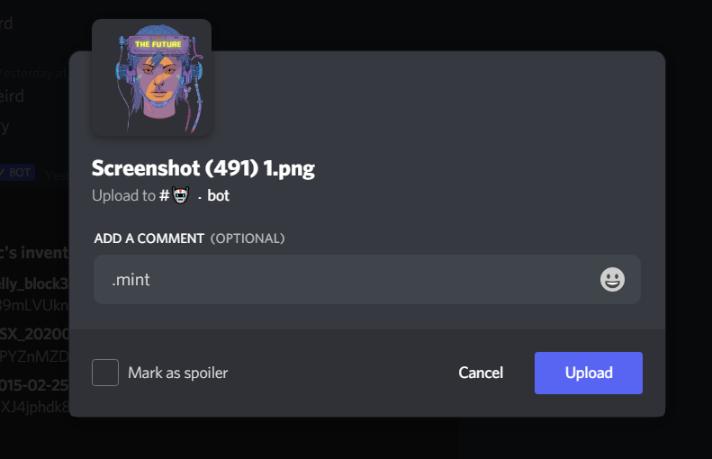

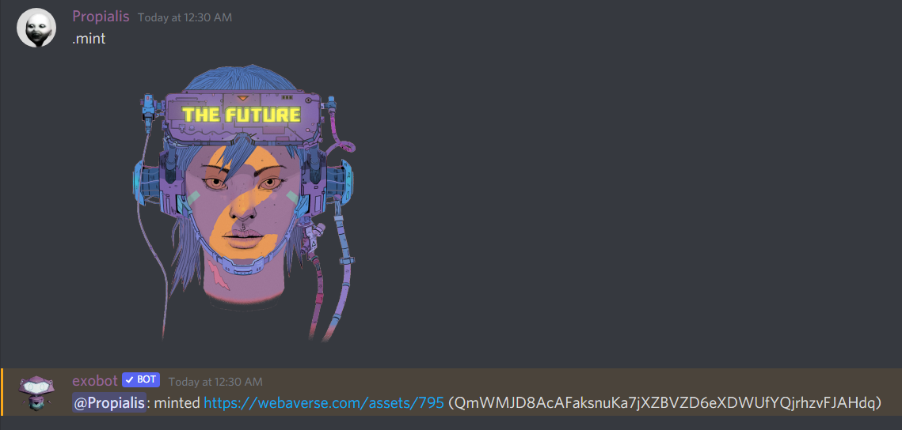

### **`.mint [count] [url]`**

mint [count] NFTs from the provided [url]

### **`.update [id] (in upload comment)`**

update nft content

## **Packs**

### **`.packs [@user|nftid]`**

check packed ft balances of [@user] or [nftid]

### **`.pack [nftid] [amount]`**

pack [amount] ft from yourself into [nftid]

### **`.unpack [nftid] [amount]`**

unpack [amount] ft from [nftid] to yourself

# **Store**

### **`.store [@user]`**

show the treasury store, or that of a user

### **`.sell [nftid] [price]`**

list [nftid] for sale at [price]

### **`.unsell [saleid]`**

unlist [saleid] from the store

### **`.buy [saleid]`**

buy the [saleid] from [@user]

# **Key Management (DM to bot)**

### **`.key [new mnemonic key]`**

set your Discord private key

### **`.key reset`**

generate and set a new Discord private key

# Logging into Webaverse

Logging in using the bot:

In a bot channel, type ".login" and press enter

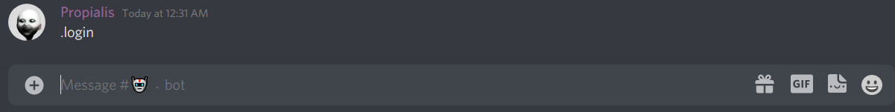

You will receive a private message from the bot, containing a link. Click on the link to continue.

After clicking on the link, your browser window will open and you will be logged into webaverse.

 

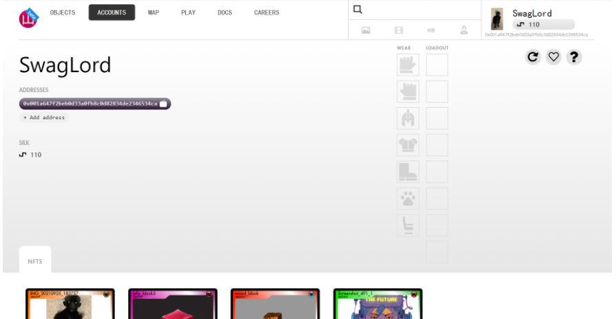

### NFT Stats:

All of your minted NFTs have certain stats associated to them. 

To check the stats of your minted NFTs you will have to log into your Webaverse account through the discord bot, and then go to the NFTs tab.

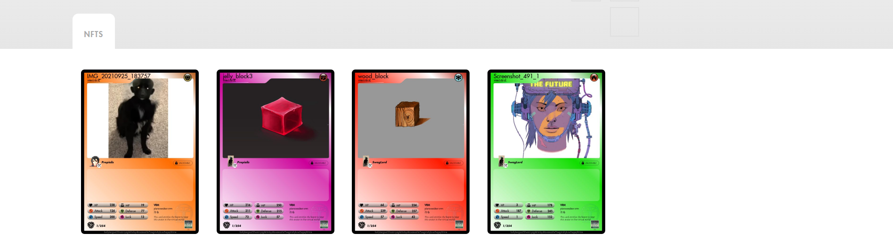

Click on any of the NFTs to view that card.

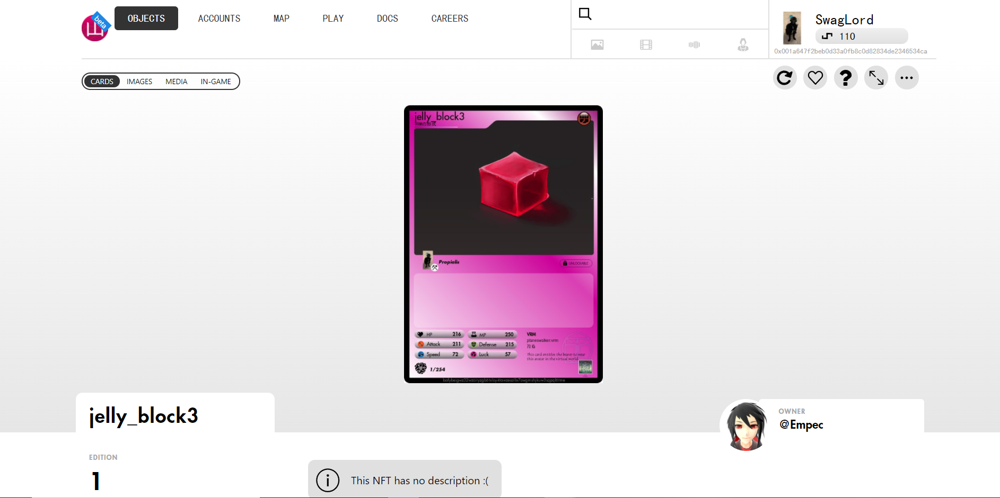

The stats will be written at the bottom of the card.

# Advanced:

- Scene (.scn) file:

[Scene (.scn) Files](https://www.notion.so/Scene-scn-Files-674ac34814384170b1734b1637048c5f) 

- .metaversefile: